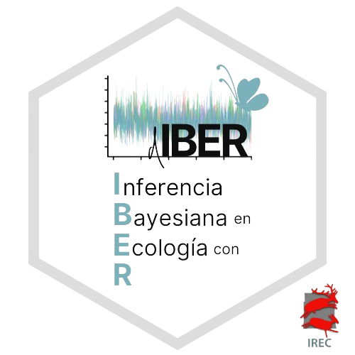

# (d)IBERticurso



Website: https://jabiologo.github.io/web/tutorials/IBER24.html

**What:** This is a workshop on introduction to Bayesian inference. Hopefully, you will learn about how to make Bayesian models for population ecology. Our hope is to provide you with what you need to go your own path in Bayesian modelling. We will present how to run occupancy model, N-mixture model, and Spatial Capture-Recapture models.

**For whom:** This is a workshop for ecologists. No previous experience with Nimble or Bayesian statistics is assumed, and few knowledge of R is required.


**Who:** Valentin Lauret, Javi Fernandez-Lopez

**When:** May 13-15, 2024. From 9h30 to 13h30.

**Where:** Sala de master, IREC, Royal City.

## Program

### Day 1 - Introduction to modelling with R and Nimble

  1. **Generalized Linear Models with R**: probability distribution, basics of programmation, simulations and models.
  2. [Introduction to Bayesian analysis and Nimble](https://vlauret.quarto.pub/diberticurso_2_introbayesian/) what is Bayesian, what is Nimble, what for in ecology.
  
### Day 2 - Ecological models

  1. Occupancy models
  2. N-mixture models
  3. Spatial Capture-Recpature
  
### Day 3 - Applications

  1. A case study by Pepe Jiménez.
  2. Work with provided datasets or your own data.
  
## Materials

  * [Codes](codes/)

## Requirements

  * Install  and .

  * Install `Nimble` following . Then run the following code in R. If that runs without error, you’re all set. If not, please get in touch with us.

```
library(nimble)
  code <- nimbleCode({
  y ~ dnorm(0,1)
  })
  model <- nimbleModel(code)
  cModel <- compileNimble(model)
```

  * Install the following R packages: `tidyverse`, `MCMCvis`. You can install them all at once by running the following code in R:

```
install.packages(c("tidyverse", "mcmcplots", "coda"))
```


